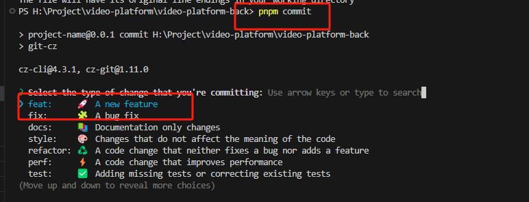
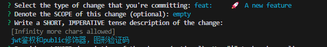
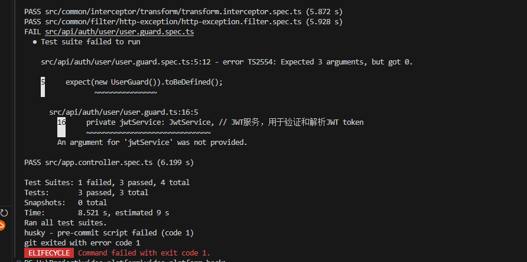

# 重构短视频平台技术方案

## 技术选型

**前端技术栈**

- React + pnpm + Vite
  **后端技术栈**
- NestJS

## 核心需求

### 基础功能（必须实现）

1. **视频播放功能**
   - 播放/暂停控制
   - 进度条拖拽
2. **内容分类系统**
   - 分类展示页面（如：热门视频、体育频道）
3. **视频切换功能**
   - 支持上下键翻页浏览

### 高级功能（可选实现）

1. **账户系统**
   - 用户登录认证
   - 视频收藏功能
2. **扩展功能**
   - 点赞/分享/关注/搜索等社交功能
   - 参考主流短视频应用进行功能扩展

------

## 后端架构方案

### 技术环境

- Node.js v20.9.0
- pnpm 9+
- MySQL 5.6
- 服务端口：8899

### 项目启动

bash

复制

```
pnpm install
npm run dev
```

### 目录结构

复制

```
src/
├── config/              # 配置目录
│   ├── .sql            # 数据库初始化脚本
│   └── dbConfig.ts     # 数据库连接配置
├── database/           # 数据库模块
├── user/               # 用户功能模块
├── app/                # 主应用模块
└── main.ts             # 入口文件
```

### 核心组件说明

| 组件类型 | 说明                          |
| :------- | :---------------------------- |
| Entity   | 数据库模型定义                |
| DTO      | 数据传输对象（网络传输/解耦） |
| VO       | 值对象（不可变数据封装）      |

------

## 开发提交流程规范！！！

为了代码质量和清晰的历史记录，一定要遵守以下步骤

1. **创建开发分支**

   ```
   git checkout -b <新分支名>
   ```

   然后在这个分支下写代码，写完之后git add .

2. **代码提交**

   ```
   git add .
   pnpm commit  # 禁止直接使用git commit
   ```

3. **提交信息规范**

   - 然后下面是你这次开发的一些类型选择，新功能(feat)，修bug(fix)这些，具体看commitlint.config.cjs
   - 
   - 选完之后输入提交信息(也就是你平时git commit -m “)的部分
   - 

   然后后面的也基本没啥，一直回车就行了
   过程中可能会不给提交，因为要走husky的钩子，eslint或者prettier的校验没过或者代码有报错啥的，解决后再走一遍流程就行。

   比如这个，就是jest的一个报错，测试用例有问题，我这里直接把spec文件删了。

   

4. **推送代码**

   如果没问题的话，提交完，直接push到远程就行了。

   ```
   git push origin <分支名>
   ```

> 不要嫌弃步骤繁琐，主要是为了代码质量和提交历史记录
>
> **注意事项**：提交前需确保通过所有代码质量检查，保持提交历史的清晰规范。
